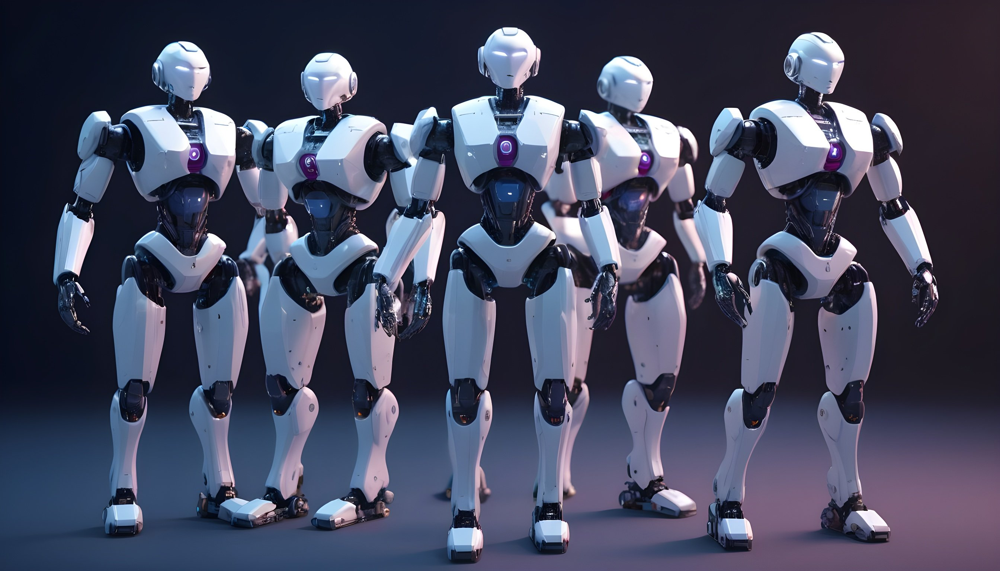

# Описание по данному репозиторию

[Отчет о выполнении задания](Report/%D0%9E%D1%82%D1%87%D0%B5%D1%82%20%D0%BF%D0%BE%20%D0%B7%D0%B0%D0%B4%D0%B0%D0%BD%D0%B8%D1%8E%20ALMAGEN.md)

## Задача

### Основная задача

Решить задачу анализа данных, описанную запросом (prompt) пользователя, двумя способами, сравнить результаты и сделать выводы:
1. Решение DS/ML: с использованием традиционного DS/ML stack, своей квалификации и опыта:
    1. провести разведочный анализ данных
    2. провести корреляционный анализ (если требуется)
    3. обучить модель, способную прогнозировать вероятность возникновения события или трендов (если требуется)
    4. ответить на поставленный в prompt вопрос
2. Решение LLM: с использованием LLM и внешних инструментов (Python code, созданный LLM и вызывающий внешние APIs):
    1. опционально: провести декомпозицию задачи (LLM)
    2. решить исходную или выделенные отдельные задачи последовательно, итеративно или параллельно (LLM)
    3. сгенерировать код на Python, использующий DS/ML frameworks/libs для анализа и визуализации данных и результатов (LLM)
    4. выполнить сгенерированный код (automatic или manual operation)
    5. объединить полученные результаты (automatic или manual operation)
    6. предоставить шаги решения и результаты/ выводы (inferences) системы в форме текстовой и графической информации (automatic или manual operation)
    7. допустимо предварительно обработать исходные данные для решения LLM
    8. допустимо незначительно модифицировать и конкретизировать исходные user prompts для решения LLM, чтобы направить LLM на получение требуемого решения

### Доработки
1) [x] ML часть: желательно использовать все features, включая "site_id", "model", "hardware"
2) [x] LLM часть:  (langchain, auto_gen, analyzeAce, TaskWeaver, crewai) для решения сложных задач, требующих генерации кода [решения](Report/решения/2.LLM_Generated_Code) 
3) [ ] 🎬 Хотелось бы видеть конечные результаты выполнения сгенерированного кода, сравнимые с уровнем решения, полученного вручную в разделе ML/DS
4) [ ] 🚀 Cамостоятельная разработка многоагентной системы для решения кодовых задач
5) [x] вариант - изменения в знаменитых проекта - [#9 в unofficial hugging chat api](https://github.com/Soulter/hugging-chat-api/graphs/contributors), [#131 issue TaskWeaver](https://github.com/microsoft/TaskWeaver/issues/131#issuecomment-1922486340) [xsa-dev/hugging-face-api fork](https://github.com/microsoft/TaskWeaver/compare/main...xsa-dev:TaskWeaver:main)
6) [ ] 🎬🎬 чтобы полученное решение еще больше приблизилось к уровню результатов ручной работы DS/ML эксперта над той же задачей в ML части; 
7) [ ] 🎬🎬 хотелось бы видеть как custom agents работают на дополнительных prompts из задания.

#### Заметки по доработкам
1) Использование 

## Итог по моделям созданным по данной задаче

Входящие данные из задания, преобразования данных проконтролированы человеком.

### Таблица итераций решения исследования по задаче 🔬

| Solution        | Data    | DEV |  Metrics   |                                                                                                                                                                 Notebook / project / script / logs                                                                                                                                                                  |   Info    |
|-----------------|---------|:---:|:----------:|:-------------------------------------------------------------------------------------------------------------------------------------------------------------------------------------------------------------------------------------------------------------------------------------------------------------------------------------------------------------------:|:---------:|
| Catboost        | Lite    | 🧠  |  acc: 60%  |                                                                                                                                                  [Savin.ipynb](Report/решения/1.Traditional_Python_DS/Savin.ipynb)                                                                                                                                                  |     ✅     |
| AutoKeras       | Lite    | 🧠  |  acc: 40%  |                                                                                                                                                  [Savin.ipynb](Report/решения/1.Traditional_Python_DS/Savin.ipynb)                                                                                                                                                  |     ✅     |
| AutoKeras       | Full    | 🧠  |  acc: 69%  |                                                                                                                                        [AK_and_Catboost.ipynb](Report/решения/1.Traditional_Python_DS/AK_and_Catboost.ipynb)                                                                                                                                        |     ✅     |
| Catboost        | Full    | 🧠  |  acc: 66%  |                                                                                                                                        [AK_and_Catboost.ipynb](Report/решения/1.Traditional_Python_DS/AK_and_Catboost.ipynb)                                                                                                                                        |     ✅     |
| analyzeAce      | Raw     | 🔥  |     🔥     |                                                                                                                                                                [🃁](Report/решения/3.Own/AnalyzeAce)                                                                                                                                                                | @xsa_dev  |
| A.L.X.Y MAS     | Raw     | 🔥  |     🔥     |                                                                                                                                                              [ALXY_MAS](Report/решения/3.Own/ALXY_MAS)                                                                                                                                                              | @xsa_dev  |
| Autogen Studio  | Raw     | 🔥  |     🔥     |                                                                                                      [#1 Project](Report/решения/2.LLM_Generated_Code/autogen_studio)   [#2 Logs](Report/решения/2.LLM_Generated_Code/autogen_studio/autogen_solution.log)                                                                                                       | Microsoft |
| Crew.ai         | Raw     | 🤖  |     ⛔️     |                                                                       [#1 Project](Report/решения/2.LLM_Generated_Code/crewai)   [#2 Sources](Report/решения/2.LLM_Generated_Code/crewai/readme.md#Исходники)    [#3 Experiments](Report/решения/2.LLM_Generated_Code/crewai/readme.md)                                                                       |  crewAI   |
| Langchain       | AI, Raw | 🤖  |     ⚠️     |                                                                   [#1 Project](Report/решения/2.LLM_Generated_Code/Langchain)   [#2 Agent 1](Report/решения/2.LLM_Generated_Code/Langchain/DS_Agent_1.ipynb)   [#3 Agent 2](Report/решения/2.LLM_Generated_Code/Langchain/DS_Agent_2.ipynb)                                                                   | LangChain |
| TaskWeaver WEB: | Raw     | 🤖  | acc: 1. ⚠️ |                          [#1 Project](Report/решения/2.LLM_Generated_Code/TaskWeaver/web)   [#2 Logs](Report/решения/2.LLM_Generated_Code/TaskWeaver/web/task_weaver.log)   [#3 Readme 🔥](Report/решения/2.LLM_Generated_Code/TaskWeaver/web/readme.md)   [#4 Models](Report/решения/2.LLM_Generated_Code/TaskWeaver/web/models)                          | Microsoft |
| TaskWeaver CLI: | Raw     | 🤖  | acc: 0.80% | [#1 Project](Report/решения/2.LLM_Generated_Code/TaskWeaver/cli/project)   [#2 Code](Report/решения/2.LLM_Generated_Code/TaskWeaver/cli/code-exp.py)   [#2 Logs](Report/решения/2.LLM_Generated_Code/TaskWeaver/cli/project/logs/task_weaver.log)   [#3 Workspace sessions](Report/решения/2.LLM_Generated_Code/TaskWeaver/cli/project/workspace/sessions) | Microsoft |

### Выводы

Первоначальные выводы по задаче предоставлены здесь: 
- [💭 Выводы](Report/Отчет по заданию ALMAGEN.md#-выводы)

#### с учетом доработок

## Дополнительно
- [Пример созданного REST API на Python c исплользованием генеративного интелекта](https://github.com/xsa-dev/fastapi_template)
- [Выполнение анализа данных с использованием генеративного интелекта](https://github.com/xsa-dev/almagen-llms-codegen-exp/blob/main/Report/%D1%80%D0%B5%D1%88%D0%B5%D0%BD%D0%B8%D1%8F/2.LLM_Generated_Code/TaskWeaver/task_weaver.log)

<small>xsa-dev | 2024 | ©</small>
